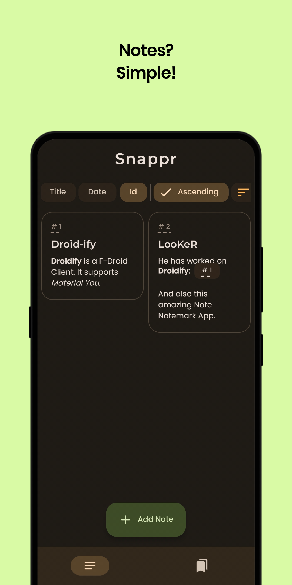
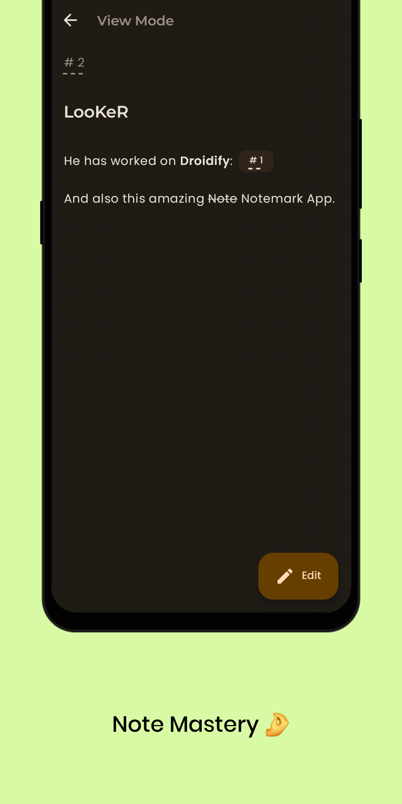
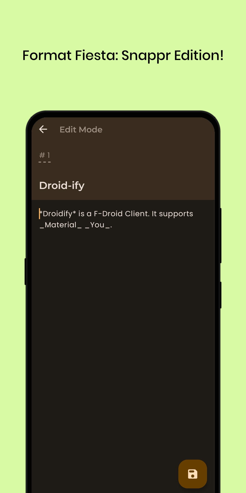
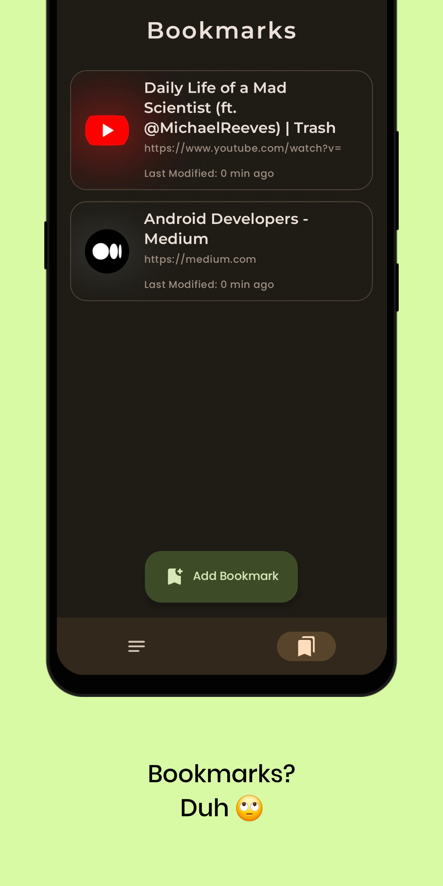

# Snappr

Snappr is a **minimalist** note-taking and bookmarking app designed to help you organize your thoughts, and save web links effortlessly. With Snappr, you can capture your ideas, format text using special characters, reference other notes, and even preview web pages - all without the need for user accounts or sign-ups.

## Features

* Material & Clean design
* Fast repository syncing
* Smooth user experience
* Feature-rich

## Screenshots

### Bookmarking Made Simple

Snappr allows you to add web links to your bookmark page in two ways:

- **Share to Snappr:** Share a web link directly with Snappr, and it will be **automatically added** to your bookmark page.
- **Manual Entry:** Add web links manually by entering the **URL** and a **brief description**.

### Text Formatting

Enhance your notes with special text formatting features. Snappr supports a variety of special characters to help you structure your content and make it more visually appealing.

### Cross-Referencing

Snappr makes it easy to reference other notes within your content. You can use the unique **ID of a note** to create links between related topics. This feature ensures that your notes are interconnected and help you maintain context.

### Web Page Preview

When you add a web link to your notes, Snappr provides a convenient **preview** of the page. This feature allows you to quickly glance at the content of the linked page without leaving your notes, saving you time and effort.

### Slick and Minimal Design

Snappr boasts a sleek and **minimalistic design** that ensures a clutter-free note-taking environment. The interface is thoughtfully designed to keep you focused on your content.

## Building and Installing
1. **Install Android Studio**:
    - Download and install [Android Studio](https://developer.android.com/studio) on your computer if you haven't already.

2. **Clone the Repository**:
    - Open Android Studio and select "Project from Version Control."
    - Paste the link to this repository to clone it to your local machine.

3. **Build the APK**:
    - In Android Studio, navigate to `Build > APK`.
    - Select "Create New Keystore" and enter the required information, including a password.
    - Wait for the build process to finish.

## TODO

- [ ] Cleanup Note Reference
- [ ] Improve color scheme
- [ ] Improve formatting UX
- [ ] Add Sample Notes
- [ ] Create Release

## Contribution

- Pick any issue you would like to resolve
- Fork the project
- Open a Pull Request
- Your PR will undergo review

## License

Snappr is open-source software licensed under the [**MIT License**](LICENSE). You are free to use, modify, and distribute Snappr as per the terms of this license.
